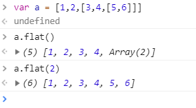
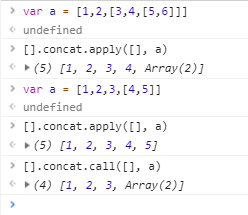

### 写一个js函数，实现对一个数字每3位加一个逗号，如输入100000， 输出100,000（不考虑负数，小数）—百度前端面试题
```
  // 我自己平时用到的方案
  function toThousands (num) {
    return (num || 0).toString().replace(/(\d)(?=(?:\d{3}) + $)/g, '$1,')
  }
```

### 数组去重
1. 最简单的方法： Array.from(new Set(targetArray))， [...new Set(targetArray)]
```
  // 单纯用new Set的话可以去重， 不过返回的数据格式是Set，所以要Array.from
  var a = Array.from(new Set([1,2,2,2, 3, 4])) // [1, 2, 3, 4]
```
2. filter
```
/**
 * 
 * @param {需要去重的数组} target
 * indexOf(searchValue, start=0)
 * arr: 会传入target
 * 对数组使用indexOf()会返回第一个匹配到的index， 所以只会返回第一次匹配
 */
function unique (target) {
  return target.filter((item, index, arr) => arr.indexOf(item, 0) === index)
}
```

### 二维数组扁平化为一维数组
1. Array.property.flat(depth), depth默认为1，会移除数组中的空项
```
var arr = [1, 2, [3, 4, [5, 6]]]
arr.flat() // [1, 2, 3, 4, [5, 6]], 默认深度1
```


2. 使用concat
```
  var a = [1,2,3,[4,5]]
  [].concat.apply([], a) // [1, 2, 3, 4, 5]
  [].concat.call([], a[0], a[1], a[2], a[3]) // [1,2,3,4,5]

  var b = [[1,2,3],[3,4],[5]]
  Array.prototype.concat.apply([], b) // [1, 2, 3, 3, 4, 5]
  Array.prototype.concat.call([], b) // [Array(3), Array(2), Array(1)] - [[1,2,3], [3,4], [5]]
```


---

### 数组reverse


### 柯里化
```
function currying (fn, ...args) {
  if (args.length >= fn.length) {
    return fn(...args)
  }
  return function (fn, ...args2) {
    return fn.apply(null, args.concat(args2))
  }
}
```

### 防抖和节流
防抖： 规定一定时间内最多执行一次
节流: (触发时间 - 上一次触发时间 >= 规定时间) ? 执行回调 ： 不执行回调, 最后统一执行一次
```
function debounce (func, delay) {
  var timer = null
  var that = this
  return function () {
    var args = arguments
    clearTimeout(timer)
    timer = setTimeout(() => {
      func.apply(that, args)
    }, delay)
  }
}

function throttle(fun, delay) {
  let last, deferTimer
  return function (args) {
    let that = this
    let _args = arguments
    let now = +new Date()
    if (last && now < last + delay) {
        clearTimeout(deferTimer)
        deferTimer = setTimeout(function () {
          last = now
          fun.apply(that, _args)
        }, delay)
    } else {
      last = now
      fun.apply(that,_args)
    }
  }
}
```


### myBind
```
functino myBind(fn, obj) {
  return function () {
    return fn.apply(obj, arguments)
  }
}
```


### 考察立即执行和匿名函数
```
var func = (function (a) { // 这个a为接受IIFE参数返回的形参
	this.a = a // second to excute, 3
	return function (a) {
		a += this.a // func(7)调用的时候执行, a = 7
		return a
	}
})(function (a,b) {
	return a // first to excute, 3
}(3,5))

func(7) // 10

分解一下： 
(IIFE1(IIFE2) {
  return function (a) {
  }
})
函数主体和参数都进行了立即执行, 所以实际上就是foo(params) {} => 先解析params => 实际就是(IIFE(3){ ... })
=> IIFE替换回来(function(a){ ... }(3)) => this.a === a === 3 => func(7)调用的时候 => 进入return function (a) a为7 => 7 + 3
```

### 考查事件循环机制
事件循环机制：宏任务script => 微任务promise.then => 其他宏任务settimeout, setInterval
```
setTimeout(function () { console.log(1) }, 0)

new Promise(function (resolve) {
	console.log(2)
	for( var i = 0; i < 10000; i++ ) {
		i == 9999 && resolve()
	}
  console.log(3)
}).then(function () { console.log(4) })
console.log(5)
// 2 3 5 4 1
```

## hasOwnProperty + Set
```
const obj = { 1: 'a', 2: 'b', 3: 'c' }
const set = new Set([1, 2, 3, 4, 5])

obj.hasOwnProperty('1') // true
obj.hasOwnProperty(1) // true
set.has('1') // false
set.has(1) // true
```


