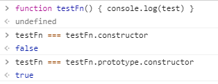
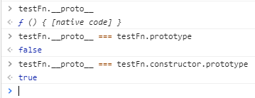
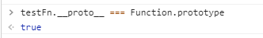
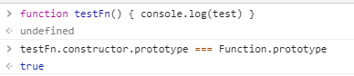
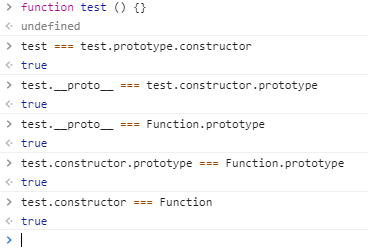

### call和apply的区别？
call(): 除了作用域外，可以接受多个参数，依次传入
apply(): apply(作用域, 参数数组), 除了作用域外，只接受一个数组参数合集
```
  var a = [1,2,3,[4,5]]
  [].concat.apply([], a) // [1, 2, 3, 4, 5]

  [].concat.call([], a) // [1,2,3,[4,5]]

  [].concat.call([], a[0], a[1], a[2], a[3]) // [1,2,3,4,5]
```

### forEach中无法使用await也无法break？
原因： 因为forEach中代码片段大概为: while( i < arr.length) { callback() }, forEach把处理的函数当作一个回调进行调用, 所以回调中的await和break不能影响到forEach
<br />
无法await解决方法： 换成for( itme of arr ) {}  
无法break的解决方法: trycatch + throw error 
```
// fix break demo:
try {
  arr.forEach((item, index) => {
      if (item !== 5) {
        // break conditions: when to excute break
        throw new Error('退出forEach循环')
      }
  })
} catch (error) {
  // handleError
  Toast(error.message)
}
```

### 词法作用域欺骗之eval()
eval()函数： 可以接受字符串为参数，并将内容是为好像在书写时就存在于程序中的这个位置的代码。 改变了程序所在的位置，混乱作用域， 所以一直都是不推荐用eval()去解析字符串的, 严格模式下无法修改作用域， eval会创建局部作用域
```
function foo (str, a) {
  eval(str)
  console.log(a, b)
}
var b = 2
foo("var b = 3", 1) // 1, 3
// 把foo函数改成了foo (str, a) { var b = 3; console.log(a, b) }
```


### prototype, constructor, 函数名, __proto__梳理
- 函数名 === 函数原型的构造函数，函数名本质是个构造函数<br /> <br />
- _proto_指向创造该对象的构造函数的原型，__proto__本质是一个原型<br />
<br />
- __proto__指向父类的原型<br /> 

<br />

- 综合2和3， 对象的构造函数的原型 === 父类的原型， 对象的构造函数 === 父类的函数对象<br />  
  <br />

> **原型总结**： <br />
  <br />