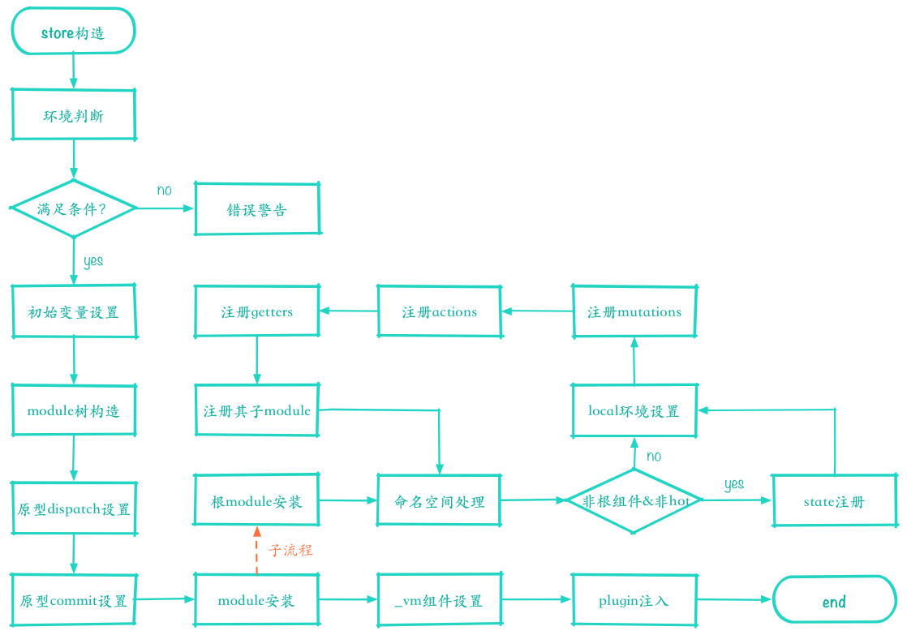

### Vuex基本demo
```
import Vue from 'vue'
import Vuex from 'vuex'
Vue.use(Vuex)

const state = {}
const actions = {}
const mutations = {}
const getters = {}

export default new Vuex.Store({
  state,
  actions,
  mutations,
  getters
})

```

### Vuex问题
1. store对象如何注入到实例？ ----> 替换Vue原型的_init, applyMixin源码(src/mixin.js)，为什么不和router一样直接Vue.mixin?

2. actions下的所有方法都包含{commit, state}， mutations的所有方法都包含{ state, actionsValue }, getter中也能拿到state， Vuex中是怎么让actions, mutations能拿到store里的其他属性的呢

3. Vuex如何区分state是外部直接修改，还是通过mutation方法修改的 ----> 通过标志变量_committing判断，外部直接修改state的话，_committing的值还是为false,只有`commit()`才能修改_committing的值为true


### Vuex源码
1. vuex和vue-router一样是插件, 自然就要暴露出一个install方法给Vue.use的时候调用

2. install主要做了两件事： 确保Vuex只安装了一次 + 把Vuex混入BeforeCreate钩子里


### Vuex注入流程(构造流程) >>> Vuex问题1
首次加载  
----> 把局部Vue变量赋值为全局Vue，运行applyMixin()  
----> applyMixin()中封装并替换Vue原型的_init方法，实现注入
----> initModule(), 把对象obj注册为module,并递归注册obj.modules为module, 为mutations, actions里的回调函数注入不同的参数
----> resetStoreVM()
> initModule的时候会为mutations中的回调注入(state, payload)参数`hanlder(state, payload) - <registerMutation方法>`, actions回调中注入`context: { dispatch, commit, getters, state, rootGetters, rootState } - <registerAction方法>`   

applyMixin源码（如何封装Vue原型的_init实现注入）
```
// applyMixin
const _init = Vue.prototype._init
Vue.prototype._init = function (options = {}) {
  options.init = options.init
    ? [vuexInit].concat(options.init)
    : vuexInit
  
  _init.call(this, options)
}

// vuexInit: Vue实例是否有vm.$options.store
// 有 vm.$options.store ? `this.$store = options.store() || options.store`
// 没, 父组件中是否有store ? 有的话拿父组件中的store
// 所以会出现一个情况： 只有root组件下才是走this.$store = options.store， 其他都是从parent里继承

function vuexInit () {
  const options = this.$options
  if (options.store) {
    this.$store = typeof options.store === 'function'
      ? options.store()
      : options.store
  } else if (options.parent.store && options.parent.$store) {
    this.$store = options.parent.$store
  }
}
```
只有根组件是拿options.store其他都是从parent继承： 如下图


### Store对象中actions, mutations, getter中能拿到store对象呢, Store对象构造  >>> Vuex问题2
Vuex.Store(obj)对象构造流程


##### 分modules的处理
将传入的对象构造为一个module对象， 循环调用this.register([key], rawModule, false)把module属性进行模块注册，转成module对象， 详情参考源码[module-collection](https://github.com/vuejs/vuex/blob/dev/src/module/module-collection.js)

##### actions和mutation中为什么能拿到store？
封装替换原型中的disptch和commit方法，使得this指向当前store， 然后在registerActions之前调用dispatch()，在registerMutations之前调用commit()
```
const store = this
const { dispatch, commit } = this
this.dispatch = function boundDispatch (type, payload) {
  return dispatch.call(store, type, payload)
}
this.commit = function boundCommit (type, payload, options) {
  return commit.call(store, type, payload, options)
}

// 初始化module的时候对mutation, action, getter下的方法注入不同的参数 + 递归注册子module
module.forEachMutation((mutation, key) => {
  const namespacedType = namespace + key
  registerMutation(store, namespacedType, mutation, local)
})

module.forEachAction((action, key) => {
  const type = action.root ? key : namespace + key
  const handler = action.handler || action
  registerAction(store, type, handler, local)
})

module.forEachGetter((getter, key) => {
  const namespacedType = namespace + key
  registerGetter(store, namespacedType, getter, local)
})

module.forEachChild((child, key) => {
  installModule(store, rootState, path.concat(key), child, hot)
})
```


