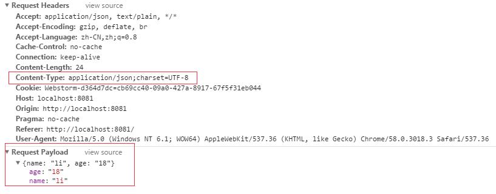
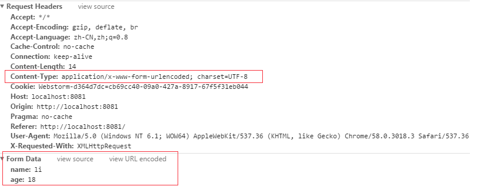
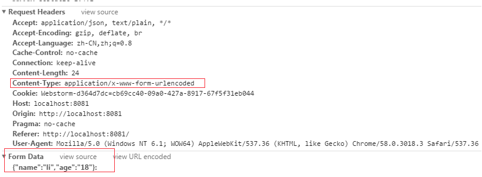
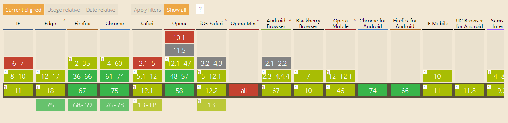

### canvas图片必须放服务器，导致项目文件过大
绘制canvas画布的时候,不希望图片放在服务器下,而希望放在upyun等cdn下节省服务器资源，缩减项目大小, 但是canvas只能绘制本地图片，不然会污染画布导致绘制不出canvas或者渲染不出图片<br />

##### 为什么不希望图片放在服务器下:
- 占用服务器太多资源
- 项目太大，首次Pull太耗时
- 影响项目运行性能
- 构建的时候耗时变长

##### 尝试过用nginx把cdn地址代理到本地，但是失败了

---

### axios设置axios.defaults.headers.post['content-type']导致报跨域的错
解决方案： 把Content-Type设置放在拦截器中
```
  import axios from 'axios'
  const apiClient = axios.create()
  apiClient.interceptors.request.use(config => {
    // 配置headers
    config.headers['Content-Type'] = 'application/json; charset=UTF-8'
    return config
  }, err => {
    return Promise.reject(err)
  })
```

---

### axios使用post的进行表单跨域, 而jquery的post没跨域
原因： axios和jquery在post方法中默认的数据格式是不同的   
axios默认数据格式为application/json
 
jquery默认数据格式为application/x-www-form-urlencoded，表单提交为formdata 


那么直接在axios中修改Content-Type头的话能行吗？  
把axios的Content-Type设置成jquery默认格式, 但是还是无法正确识别成key-value键值对的formdata



所以当axios中要求数据格式为formdata的时候，我们就需要进行**qs.stringify(dataObj)** 或者 **new URLSearchParams()**
```
// qs
import qs from 'qs'
var data = {
  name: 'testName',
  age: 14
}
axios.post(targetUrl, qs.stringigy(data)).then(res => {})


// URLSearchParams, 有兼容问题, 需要引入polyfill
var params = new URLSearchParams
params.append('name', 'testName')
params.append('age', 14)
axios.post(targetUrl, params).then(res => {})
```

### canvas绘制图片之前，需要先把图片转换成一个HTMLDOMElement
```
function createImg (src) {
  return new Promise((resolve, reject) => {
    var img = new Image()
    img.setAttribute('crossOrigin', 'anonymous')
    img.onload = () => {
      resolve(img)
    }
    img.src = src
  })
}
this.crateImg(urlPath).then(imgElm => {
  // 绘制图片
})
```

### 安卓输入框遮挡scrollIntoView()，如果考虑兼容问题的话, 只能够在oninput的时候重新计算整个window的高度
```
setScroll () {
  var elm = document.getElementById('nameInput')
  elm.scrollIntoView()
}
```

